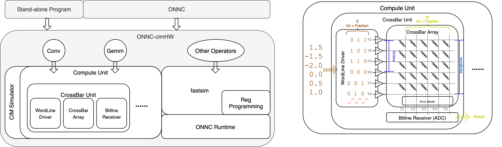

onnc-cimHW – A crossbar based CIM Hardware Simulator
==
*A simulator to simulate xbar computation and inspect the calculation performance*

[[_TOC_]]

## Preface
This project aims to create a simulator for researcher to inspect the cross bar performance in CIM architecture. onnc-cimHW provides a fast tool to evaluate device characteristics. It is capable to simulate in fast behavior mode for functionality validation. This also supports to simulate operators that hardware model doesn't have.

## System Overview
onnc-cimHW refers to [ONNX Operator v1.3.0](https://github.com/onnx/onnx/blob/v1.3.0/docs/Operators.md) to provide a unified interface for operator simulation. By now, Conv and Gemm are the two operators with CIM features, for other operators, it will just interpret through via library fastsim. With the help of abstract layer and fully supported operators, whole model simulation becomes very easy either for stand-alone program or ONNC, it also allows developer to override existing operators with CIM-hardware feature to extend simulation capability. onnc-cimHW not also reduces the burden on simulation but also provides a way to replace existing simulation seamlessly.

onnc-cimHW now provides 2 hardware units for simulation, Compute Unit and CrossBar Unit. A Compute Unit comprises several Crossbar Units and a Crossbar Unit consists of a wordline driver, a crossbar array and a bitline receiver. The cells of crossBar array could be set by a size of wordline of vector W with specified length of bits. A Wordline driver also accepts a size of wordlines of vector X and decomposes it into given length of bits. Both vectors X and W could be quantized and shifted by length parameters Int and Fraction. For each cycle, wordline driver electrifies maximum OUSize of wordlines into crossbar array, then bitline receiver would accumulates sensed amplification with error model adjusted cycle-by-cycle into final result.



## Get started
onnc-cimHW supports **stand-alone mode** and **work-load mode**. Stand-alone mode needs library ONNC Runtime to build with and work-load mode is to make onnc-cimHW as a shared library to be called by ONNC. For stand-alone mode, user can generate a model manually in program to call onnc-cimHW directly. On the other hand, ONNC has been binding to onnc-cimHW via CIMBackend, so we can benefit from it to load various ONNX model and performing hardware simulation as well. This makes it possible to use existing ONNX models immediately, largely eases the effort of making model manually. We will first illustrate how to get started in stand-alone mode and introduce build ONNC with onnc-cimHW later.

### Prerequisite
- [Docker](https://www.docker.com/)
- [ONNC Community Docker image](https://hub.docker.com/r/onnc/onnc-community/)

### Step to buid in **stand-alone mode**:
- Use git to clone project and switch to designated branch. Currently, source code is at [onnc-cim](https://gitlab.com/hankkuo/onnc-cim)
    ```bash
    git clone https://gitlab.com/skymizer-research-lab/onnc-cim.git && cd onnc-cim
    ```
- Run docker and mount cloned repo to `/onnc/onnc` in container. Note that the path in container cannot be changed and `pwd` should be in absolute path to onnc repo.
    ```bash
    docker run -it -v `pwd`:/onnc/onnc --cap-add=SYS_PTRACE --security-opt seccomp=unconfined onnc/onnc-community:latest
    ```
- After get into container. Change directory to onnc-cimHW and perform out-of-source build. onnc-cimHW uses ONNC Runtime as default behavior for unsupported operators. Option `-DCMAKE_BUILD_TYPE=Release` is for building withoug debug information, this can really help to accelerate executtion. Otherwise, `-DCMAKE_BUILD_TYPE=Debug` can be used instead for development.
    ```bash
    mkdir -p /onnc/onnc-cimHW.build && cd /onnc/onnc-cimHW.build
    cmake -DCMAKE_BUILD_TYPE=Release /onnc/onnc/skysim/onnc-cimHW
    make -j8
    ```
- Lastly, install library to system path. Don't forget to update ld cache.
    ```bash
    sudo make install
    sudo ldconfig
    ```
- Run example see if whole building success.
    ```bash
    ./example/main share/cimConfig.json
    ```
    - This should print a line of number like this:
    ```bash
    Result: 
    673.5, 673.5, 673.5, 673.5, 673.5,
    ```

- (optional) For tests, additional CMake option is needed to configure in build directory. This will pull gtest repository and build again. Test cases will be built to a single `test_all` program in tests folder.
    ```bash
    cmake -DBUILD_TESTS=ON /onnc/onnc/skysim/onnc-cimHW && make
    ```
    - Run test_all with CIM configuration file to ensure building result.
        ```bash
        ./tests/test_all share/cimConfig.json
        ```

### Step to buid **work-load mode** (a.k.a. linked by ONNC):
This special repo [onnc-cim](https://gitlab.com/hankkuo/onnc-cim) has been modified to build with onnc-cimHW. Note that stand-alone building has to be prior than this step so that onnc-cimHW shared library can be found.
```bash
cd /onnc/onnc-umbrella/build-normal
smake -j8 install
```

Then onnc-cim will be installed to `/onnc/onnc-umbrella/install-normal/bin` which is added to environmental variable $PATH. Then we can use onnc-cim to inference onnx models.

- Change to `skysim/onnc-cimHW/share` for shorter path
    ```
    cd /onnc/onnc-cimHW.build/share
    ```
- nn on MNIST
    ```
    onnc-cim -mquadruple cim nn_mnist/model.onnx \
    --cim-interpreter-input nn_mnist/test_data_set_0/input_2.pb \
    --cim-config cimConfig.json
    ```
    - compared with ONNI
        ```
        onni nn_mnist/model.onnx nn_mnist/test_data_set_0/input_2.pb 
        ```
- bvlc_googlenet on imagenet (use class 231 dog as example). Here -v -v is used to turn on verbosed mode of onnc-cim (not onnc-cimHW). This may takes a few minutes.
    ```
    onnc-cim --mquadruple cim googlenet_imagenet/model.onnx \
    --cim-interpreter-input googlenet_imagenet/dog-231.pb \
    --cim-config cimConfig_16-16.json
    ```
    - compared with ONNI
        ```
        onni googlenet_imagenet/model.onnx googlenet_imagenet/dog-231.pb
        ```
**For more information about ONNC, please refer to [main page](../../README.md)**

### ONNC usage and options for CIM backend:
```
onnc-cim <file-to-onnx-model> [options]

options:
--mquadruple cim
  Required. Use CIM as backend.
    
--cim-interpreter-input <pb-file-to-input-tensors>
  Required to turn on interpret. Input tensors of the onnx model.
  
--cim-config <cim-config-json>
  Required. Device configuration in json format. Refer to device configuration for details.

--cim-interpreter-output <file-to-store-interpret>
  Optional. Display to screen if not specified.
```


## Supported Simulation
Generally, onnc-cimHW uses fastsim to simulate operator if there is no implemntation (Now only Conv and Gemm have specific implementation). We follow the specification of [ONNX framework v1.3.0](https://github.com/onnx/onnx/tree/v1.3.0), all the operator related interface such as inputs, outputs and attributes are generally identical to the schema. User can refer to [How to write a program calling onnc-cimHW simulation]() to have an idea how to call these simulation, but has to check detail spec from [ONNX Operator v1.3.0](https://github.com/onnx/onnx/blob/v1.3.0/docs/Operators.md).

**Note: ONNX IR=3, opset=8 are used as development standard for now.**


## Folder Structure
Project hierarchy is briefing as following:
- example/
  Example to show how to run models in stand-alone mode.
  
- external/
  Third-party libraries used in onnc-cimHW.

- include/
  Public headers. User can include these headers to use onnc-cimHW.

- lib/
    - diagnostic/
      Error message handling library.
    - factory/
      Abstract factory to create operators.
    - hardware/
      Hardware-like components.
    - wrapper/
      A wrapper to call fastsim, which is a library to 
    - conv.hh/.cc
      onnc-cimHW implementation for convolution.
    - gemm.hh/.cc
      onnc-cimHW implementation for GEneral Matrix Multiplication.

- scripts/
  Here the auto-gen script and templates are placed.
  
- share/
    - cimConfig_*.json
      CIM configuration in json. Refer here to get property details.
    - errorTable.json
      Error models in json. This file should be a list in 3 dimension which is used for inserting error after cross bar.

- tests/
  Test cases for onnc-cimHW.

- CMakeLists.txt
  Building script of CMake.


### onnc-cimHW configuration (.json)
onnc-cimHW uses json to define device configuration. All fields are **MUST REQUIRED**. We will explain via a sample below. **Note that comments are easy for explaination but invalid in json format.** There are some pre-defined configuration in `share/` folder.
- "xbarNum": int | 
  The number of CrossBarUnit in a ComputeUnit
- "xbarSize": object | 
  The size of a cross bar
  - "wordlines": int | 
    The maximum of wordlines can be electrifed
  - "OUSize": int | 
    The maximum of wordlines to be electrified in a cycle, less or equal than wordlines
- "QuantizeLength": object | 
  Quantization length
  - "X": object | 
    X will be put into WordlineDriver
    - "Int": int | 
      The length of integer part to be quantized for X
    - "Fraction": int | 
      The length of fraction part to be quantized for X
  - "W": object | 
    W will be put into CrossBarArray, Int + Fraction = bitlines of CrossBarArray
    - "Int": int | 
      The length of integer part to be quantized for W
    - "Fraction": int | 
      The length of fraction part to be quantized for W
- "ErrorModel": string | 
  Path to error model in json format, empty refers no error model.
  Note that the location of the path is relative to this configuration file.
  Refer to [Error Model section](#onnc-cimHW-error-model-json) for detail.
- "Verbose": int | 
  Verbose level, 0 for no verbose message, 2 is the maximum

An simple example of CIM configuration file, placed in share/cimConfig.json
```json
{
  "xbarNum": 1,
  "xbarSize": {
    "wordlines": 10,
    "OUSize": 5
  },
  "QuantizeLength": {
    "X": {"Int": 8, "Fraction": 8},
    "W": {"Int": 8, "Fraction": 8}
  },
  "ErrorModel": "",
  "Verbose": 0
}
```  

### onnc-cimHW error model (.json)
onnc-cimHW provides a way to load pre-generated error model to be looked up to change the cross bar's result. This approach doesn't matter how the error model is generated and what the distribution of the error model is. User just need to compile the error model as 3 dimension list in jason format and specify the error model path in configuration file. onnc-cimHW will load it automatically.

The format of the 3-D list is like this:
[openwordline][value][changed]

- [openwordline] refers to the wordlines electrified as high voltage in a cycle of computation. Note that open wordline means the hight voltage in an operation unit, not necessarily the size of wordlines of a operation unit. **1 electrified openwordline maps to index 0 so a maximum wordlines M of crossbar array should have maximum openwordline index M-1.**

- [value] refers to the answer value(amp) should be sensed given the cycle of open wordlines electrified. The size of dimension equals to the number of openwordline.

- [changed] should be a list of 100 integers. It refers to the distribution of actual changed value given the answer value. For example, if there is 80% the value changed to 1, 15% changed to 0, 5% changed to 2. Then it will be a list of 100 numbers with 80 1s, 15 0s and 5 2s.

For example, let's assume a cross bar array with 100 wordlines, width 10 of operation unit, a cycle electrified with 4 high voltage amough these 10 wordlines and answer value is 5. Then the value to be changed for this cycle is at [openwordline=4][value=5][random(0,99)]

Here is an example to illustrated for an error model json file.
```json
[ // openwordline
  [ // value
    [0, 0, 0, 1, 1, 1, 1, 1, 1, 1, 1, 1, 2, 2, ...] // 100 numbers
    [0, 0, 0, 1, 1, 1, 1, 1, 1, 1, 1, 1, 2, 2, ...] // 100 numbers
    [0, 0, 0, 1, 1, 1, 1, 1, 1, 1, 1, 1, 2, 2, ...] // 100 numbers
    ...
    ...
  ]
  ...
  ...
]
```

An example of error model is placed in `skysim/onnc-cimHW/share/errorTable.json`.

## More Tutorials
- [How to write a program calling onnc-cimHW](docs/How_to_write_a_program_calling_onnc-cimHW.md)
- [How to implement a new operator in onnc-cimHW](docs/How_to_implement_a_new_operator_in_onnc-cimHW.md)

## FAQ
