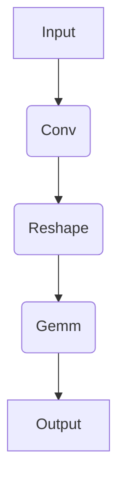

How to write a program calling onnc-cimHW
==

[[_TOC_]]

## Preface
onnc-cimHW can perform simulation directly without ONNC. This is so-called ++stand-alone mode++. Writing a program to call simulator is simple, this will guide you through an example.

## Development Process
Generally, simulating a model by onnc-cimHW in program is easy broken down into several steps as follows. Besides initialization in first step and printing result in last step, a model is decompsed into operators and we will prepare and simulate these one-by-one.

1. Initialize simulator and decompse a models to operators
1. For each operator
    1. Check the specification for operator
    1. Prepare input, output and attributes tensors
    1. Call onnc-cimHW function and get output
1. Have the final result

## Implementation
### Initialize simulator and decompse a models to operators
First of all, we need a program body to include necessary headers. For onnc-cimHW, `cimHWOp.hh` and `cimHWSimulator.hh` are needed, `vector` is for easy manipulating tensors and `iostream` is to print out. `cimHWSimulator` is the facade interface to provide simulation for each operator, which needs a cim configuration file for operator simulation. Thus, the program needs to accept a path to configuration file. For information about the cim configuration, please refer to [onnc-cimHW configuration](../README.md#onnc-cimHW-configuration-json).


    
Secondly, assume we have a model with 3 layers as figure above. We will allocate the resource for input tensor in the last. Note that the sequence of dimension is followed by Caffe, so here we have a tensor with 4 dimensions {1, 1, 5, 5} which represents {Batch, Channel, Height, Width}. A `const std::vector<dim_type>` is used to represent the shape vector in dimension type for non-modifiable and `element_type` array to represent the content of input tensor in element type.
```cpp=
#include <cimHWOp.hh>
#include <cimHWSimulator.hh>
#include <iostream>
#include <vector>
using namespace cimHW;

int main(int argc, char *argv[])
{
  // cinfiguration file must be provided
  if(argc != 2)
  {
    std::cout << "Usage: ./main <cimConfigFile>" << std::endl;
    exit(1);
  }
  std::string configFile(argv[1]);

  // tensor shape definition (Batch, Channel, Height, Width)
  // define a model with only 1 operator
  // input(1x1x5x5)     = 1x1x5x5
  // conv1(1x3x5x5)     = Conv(input, kernel=3x1x3x3, bias=1x3, pads=[1,1,1,1], strides=[1,1])
  // reshape1(1x75)     = Reshape(conv1, shape=[1,75])
  // output(1x5)        = Gemm(reshape1, gemmB=5x75, transA=0, transB=1)

  // initialize simulator
  cimHWSimulator ops;

  // allocate input, output and internal tensors
  // input(1x1x5x5)
  const std::vector<dim_type> input_shape {1, 1, 5, 5};
  element_type input[] = {
    1.5, 1.0, 0.5, 1.5, 1.0,
    1.5, 1.0, 0.5, 1.5, 1.0,
    1.5, 1.0, 0.5, 1.5, 1.0,
    1.5, 1.0, 0.5, 1.5, 1.0,
    1.5, 1.0, 0.5, 1.5, 1.0
  };

  ...
  ...
  ...
  
  return 0;
}  
```

### Check the specification for each operator
Then we will deal with each operator one-by-one, here the first operator `Conv` is used for example.

onnc-cimHW followed the specification of ONNX v1.3.0 which has the IR=3 and opset=8. From [ONNX Operator](https://github.com/onnx/onnx/blob/v1.3.0/docs/Operators.md#Conv), we can have an idea what are the attributes, inputs and outpus are and what do they mean including datatype, required or optional.

Then it is also recommended to check the API in `cimHWSimulator.hh`. Here we have `cimHWSimulator::cimHW_Conv_float` look like below. Basically it is identical to ONNX Operator definition but in C++ format. `context` is for passing anonymous information, here we use it for passing the path to configuration file. `element_type` means the element of a tensor, usually in float and `dim_type` refers to the shape of a tensor, usually in int32. Prefix `const_` stands for the qualifier of the data type. Mostly, only output tensor are mutable in all operators.
```cpp=
void cimHW_Conv_float(
  void* context
  ,const_element_type* input_X, const_dim_type input_X_ndim,  const_dim_type* input_X_dims
  ,const_element_type* input_W, const_dim_type input_W_ndim,  const_dim_type* input_W_dims
  ,const_element_type* input_B, const_dim_type input_B_ndim,  const_dim_type* input_B_dims
  ,element_type* output_Y ,     const_dim_type output_Y_ndim, const_dim_type* output_Y_dims
  ,const char* auto_pad
  ,dim_type* dilations,         const_dim_type number_of_dilations
  ,dim_type group
  ,dim_type* kernel_shape,      const_dim_type number_of_kernel_shape
  ,dim_type* pads,              const_dim_type number_of_pads
  ,dim_type* strides,           const_dim_type number_of_strides
);
```

### Prepare input, output and attributes tensors
For each operator, input is usually the tensor from previous operator except the first operator. For output tensor and other attributes, we have to allocate one-by-one before calling onnc-cimHW interface. **Every tensor has to be allocated except it is marked as optional in the ONNX Operator Document** Here is a rule, if the tensor is more than one-dimension, an array to store the tensor content is required, otherwise, a `std::vector` is enough to represent shape and content of a tensor.

For example, `weight`'s dimension is 4, so it needs a `std::vector` to represent the shape tensor `weight_shape` and another array `weight[]` to represent the content.

For dilation, it is a 1-d tensor, so a `std::vector` is enought to represent the shape (It must be 1 x size) and content.

```cpp=
  // layer 1:
  // conv1(1x3x5x5)     = Conv(input, weight=3x1x3x3, bias=1x3, pads=[1,1,1,1], strides=[1,1])
  // allocate constant resource
  // kernel(1x3)
  const std::vector<dim_type> weight_shape {3, 1, 3, 3};
  const_element_type weight[] = {
    1.5, 1.0, 0.5,
    1.5, 1.0, 0.5,
    1.5, 1.0, 0.5,

    1.5, 1.0, 0.5,
    1.5, 1.0, 0.5,
    1.5, 1.0, 0.5,

    1.5, 1.0, 0.5,
    1.5, 1.0, 0.5,
    1.5, 1.0, 0.5
  };
  // bias(1x3)
  const std::vector<dim_type> bias_shape {3};
  const_element_type bias[] = {
    1.5, 1.0, 0.5
  };
  // conv1(1x3x5x5)
  const std::vector<dim_type> conv1_shape {1, 3, 5, 5};
  element_type conv1[75];
  // dilation(1x2)
  std::vector<dim_type> dilations {1, 1};
  // group(1)
  const_dim_type group = 1;
  // kernel(1x2)
  std::vector<dim_type> kernel {3, 3};
  // pads(1x4)
  std::vector<dim_type> pads {1, 1, 1, 1};
  // strides(1x2)
  std::vector<dim_type> strides {1, 1};
```

### Call onnc-cimHW function and get output
After all tensors are allocated, it is just a snap to call simulator. Follow the interface we looked up in `cimHWSimulator.hh` in [section above](#Initialize-simulator-and-decompse-a-models-to-operators). Just pass variable to corresponding location, then the simulation is executed. Note that we need to reinterpret variable configFile to first argument `void*`.

```
  ops.cimHW_Conv_float(
    reinterpret_cast<void*>(&configFile),
	input, input_shape.size()  , input_shape.data(),
	weight, weight_shape.size() , weight_shape.data(),
	bias  , bias_shape.size()   , bias_shape.data(),
	conv1 , conv1_shape.size()  , conv1_shape.data(),
    "",
    dilations.data(), dilations.size(),
    group,
    kernel.data(), kernel.size(),
    pads.data(), pads.size(),
    strides.data(), strides.size()
  );
```

### Have the final result
After all the operators are simulated by order, the final output tensor of last operator is the result of all execution. Here `conv1` is the result of the given model and input tensor. We can use a simple for loop and cout to print it.
```cpp=
  // cout the compute result
  std::cout << "Result: " << std::endl;
  dim_type size = 1;
  for(dim_type i=0; i<conv1_shape.size(); i++)
    size *= conv1_shape[i];
  for(dim_type i=0; i<size; i++)
    std::cout << conv1[i] << ", ";
  std::cout << std::endl;
```

## More about the tutoral
This tutorial is part of example code in `skysim/onnc-cimHW/example/main.cc`. Please refer to the source code for full implementation of this 3 layers of model.